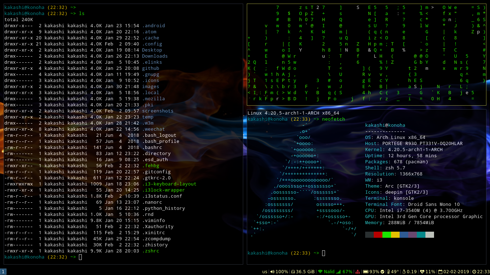

# Archmallow
This is a n00bs collection of notes and templates related to installing Arch and customizing i3-gaps. It's not meant to be a *"yet another Arch installation tutorial"*, but rather to address a set of practical problems a beginner faces when installing Arch and i3-gaps. This repo is mainly for personal use, hopefully somebody else could find something useful here

# Installation
- [Arch Linux install](./docs/arch-install.md)
- [Creating a new user](./docs/new-user.md)
- [Network installation](./docs/network.md)
- [Setting locale](./docs/locale.md)
- [Enabling Num Lock on startup](./docs/numlock.md)
- [Some utilities](./docs/utilities.md)
- [Installing and ricing i3-gaps](./docs/i3-gaps.md)
- [Notes on sound setup](./docs/sound.md)
- [Backlight adjustment](./docs/backlight.md)
- [Firefox tweaking](./docs/firefox.md)
- [Enabling touchpad tapping](./docs/touchpad-tap.md)
- [Bluetooth](./docs/bluetooth.md)
- [Dual-boot time problem](./docs/time-problem.md)

# Other
- [Other goodies](./docs/more.md)
- [Some Pacman useful commands](./docs/useful-pacman-commands.md)
# Putting it all together

